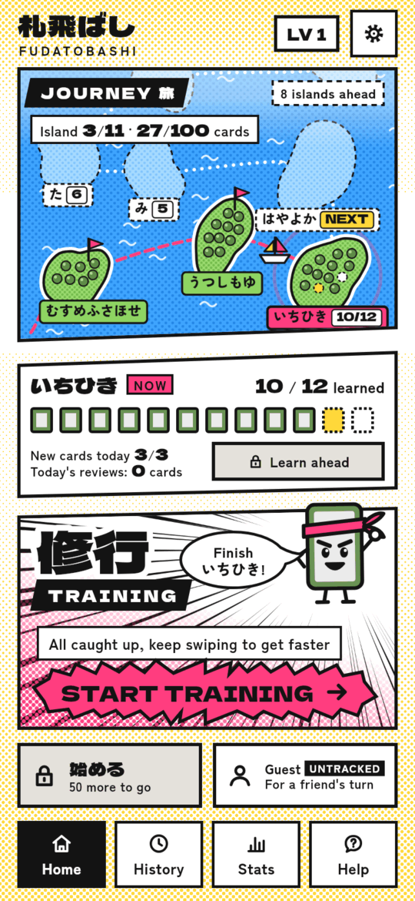
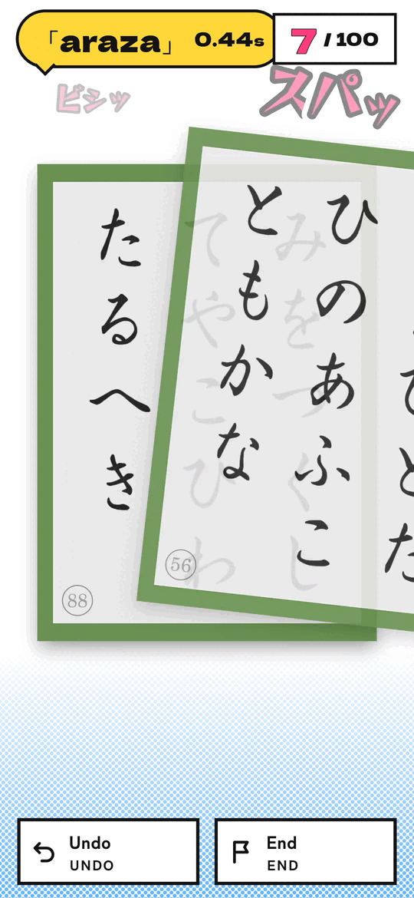
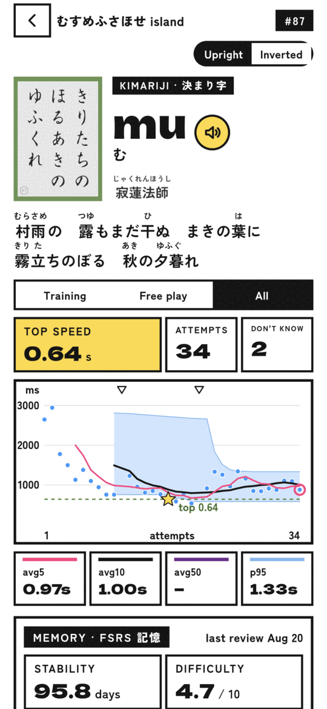

# 札飛ばし Fudatobashi

A 札落とし trainer for competitive karuta with SRS. 
Say the kimariji and flick the card away, as fast as you can.

[Downloads](#downloads) · [Contributing](#contributing) · [License](#license)

 

<table>
  <tr>
    <td align="center"> Journey mode on the Kana Islands</td>
    <td align="center"> A card flying away after a fast swipe</td>
    <td align="center"> Every card has its own speed graph</td>
  </tr>
</table>

## Mission

Fudatobashi and its developers are committed to opening the world of karuta to more people. We dedicate this app so that karuta may thrive. It will remain free forever for everyone still learning karuta, until they are good enough to join a karuta club.

## Downloads

Get the newest version on the [Releases page](https://github.com/StoneLabs/fudatobashi/releases/latest).

| Platform | File ends in | How to install |
|-|-|-|
| Android | `-GH_SIGNED.apk` | Open the file on your phone. When Android asks, allow installs from this source. |
| iOS | `-unsigned.ipa` | The file is not signed. Install it using [Sideloadly](https://sideloadly.io) or another sideloading application. |
| macOS | `-macos.zip` | Unzip it. The first time, right-click the app and choose Open. |
| Windows | `-windows.zip` | Unzip it and start `fudatobashi.exe`. If SmartScreen stops it, click More info and then Run anyway. |
| Linux | `-linux.tar.gz` | Extract it and run `bundle/fudatobashi`. |

The APK on GitHub and a future store version are signed with different keys. So one cannot update the other. To switch you have to uninstall your current version first.

## Contributing

Found a mistake, or have an idea? Thank you!

1. **Open an [issue](https://github.com/StoneLabs/fudatobashi/issues) first.** I usually answer quickly.
2. **If the change makes sense, I add the [`PR Welcome`](https://github.com/StoneLabs/fudatobashi/labels/PR%20Welcome) label** to the issue.
3. **Then open a pull request** for that issue. Pull requests without an issue labeled `PR Welcome` are generally not accepted.

When you change the code, please build with the Flutter version in [`.fvmrc`](.fvmrc), and run `./scripts/check.sh` before you push. It runs the analyzer and all tests. Commit messages follow [Conventional Commits](https://www.conventionalcommits.org) on one line, like `fix(ui): keep the timer on one line`.

## License

The code is free and in the public domain under [the Unlicense](LICENSE).

Assets made by other people keep their own licenses. The fonts are under the OFL and the GUST Font License. The sound effects by [Kenney](https://kenney.nl) are CC0. The music "fun bgm 022824" by [syncopika](https://opengameart.org/content/fun-bgm-022824) is under CC BY 3.0. The spoken kimariji are an AI voice made with Gemini TTS. The poem data comes from [hyakuninissyu-csv](https://github.com/StoneLabs/hyakuninissyu-csv). You can find every credit in the app under Settings › Licenses & credits.
